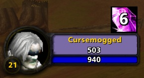

Made for vanilla wow 1.12.1/Twow

Displays the amount of soul shards in your bag. The font is Expressway but the addon references to the standard FRIZQT font used by blizzard so it might not look the same for you (i swapped the default font)

Addon fully made with chatgpt. If you want to make changes just paste the whole LUA in a prompt and try to figure it out

/sc lock,unlock ingame to move it around
